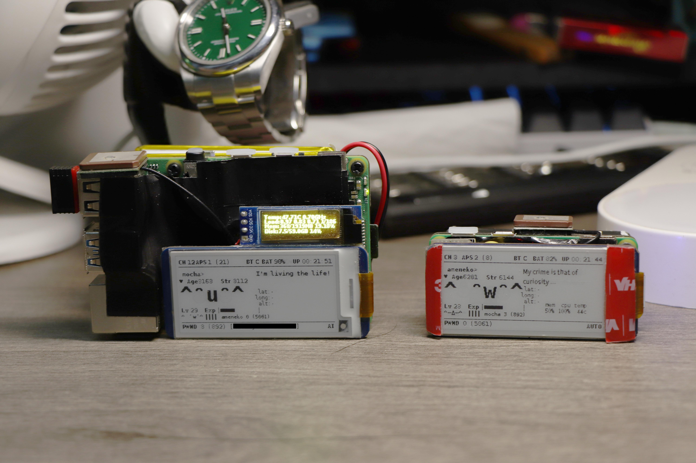

# Pwnagotchi with RTC and GPS module and more...

My pwnagotchis:




Sadly, I accidently shorted 3A+'s USB port and it is not working... But I will get the board replaced (that depends on element14's shipping time).

So, let's get started armouring our pwnagotchis!

### Part one: Modules

Because I want pwnagotchis as compat as possible, I picked these modules:

- DS3231 for Pi
  
  It's awesome for us to have an high accuracy RTC for pis. DS3231 Pi module is the most available thing on eBay or AliExpress, so I choose it for RTC option.
  
  And, there are two variants of DS3231: DS3231SN and DS3231M. For room temperature, DS3231 operates at 2ppm and DS3231M at 5ppm (these are theoretically max error). As Pete addresses in his blog, chip's drifts are very close to zero (original post:[DS3231 Drift Results (5 months)](https://blog.heypete.com/2018/02/04/ds3231-drift-results-5-months/)). 
  
  If you are interested in building your own custom PCB for RTC, I recommend to choose DS3231M because its accuracy is good and don't affected by heat (A running pwnagotchi is HOT!). Also, Maxim provides an smaller 8-SOIC package for DS3231M (DS3231MZ) so it's nice.

- ATGM336H GPS module (or U-blox MAX-10S)
  
  Also, we need to record the GPS coordinate for pwned Wi-Fi. ATGM336H is my option because there are already a module for this GPS chip with SuperCap and EEPROM. If you want to use U-blox's module, you need to design a small PCB for MAX-10S module by yourself. I'd prefer U-blox's, but there are no modules readymade, so I just used ATGM336H.

- SSD1306 OLED screen (Adafruit PiOLED)
  
  Adafruit's module is no cheap and hard to find in China. So some general oled modules are also fine when it uses SSD1306 for controller. You can buy 0.96" or 0.91" screen depends your preferences. For me, I prefer to buy 0.96" (128x64) for 3A+ & 3B/3B+/4B and no screen for Zero / Zero2.

- PiSugar 3 for portability (optional)
  
  In common, I like to bring a power bank for pwnagotchi for a long lifetime, but have a battery for pwnagotchi is cool when it's uncovenient. I use PiSugar 3/Plus for my pwnagotchi with this awesome plugin by taiyonemo: [pwnagotchi-plugin-pisugar3](https://github.com/taiyonemo/pwnagotchi-plugin-pisugar3). It shows battery percentage, voltage and temperature of mcu. You can also use other battery modules because there are already lots of plugins for those modules.

### Part two: Installation

After we got our modules, it's time for beautify our pwnagotchi!

Installation part is kind of a straightfoward step: glue modules in a proper space and solder cables.

For glue these modules in place, I used 3M VHB tape. It's sticky enough and insulated so I don't need to care about short circuit or so.

For cables, I use 0.5mm Teflon coated wire (~24AWG). It's thin enough to connect solder pads and fit in place.

For my 3A+ with 2.13inch e-Paper HAT:


- We need to remove female connector on DS3231 module due to size problems.
- All three modules uses 3.3V for VCC, so connect all VCCs to Pin 1 or 6. The 1 pin is hard to weld (under the connector!) so I choose 6 for 3.3V.
- 2 is I2C SDA and 3 is I2C SCL. Because DS3231 and SSD1306 both use I2C interface, just simply connect these pads together. RTC module and screen has its own silk mark, so if your module is not like mine, you need to find out correspond pads. By the way, it's hard to weld 2 and 3 pin at first place, so be careful not to melt the plastic connector for e-paper screen.
- 4 and 5 is Pi's miniUART. Pis don't have a lot UART interfaces, so our only choice is miniUART/PL011. For default, PL011 is for bluetooth and we need a constant connection via bluetooth, so our only choice is miniUART. (For Pi 4B, there are five PL011s so see below for 4B). Module's RX to Pi's TX and module's TX to Pi's RX. Simple.
- Also, I want to use GPS module's PPS to feed the pi for time syncing. So, I connected module's PPS pin to 7 (GPIO5). Need extra config for this.

### Part three: Configuration

Configuration is easy but not same for different pis. Carefully read my comments on every configuration because improper config may fried your pi (especially over/underclock options)!

- Open I2C Interface (Should open by default, but check twice isn't a bad idea)
  
  - Edit /boot/config.txt
    
    ```toml
    # If you can find this line, that means your i2c interface
    # is opened. If not, add these lines.
    dtparam=i2c_arm=on
    dtparam=i2c1=on
    ```

- Configure DS3231
  
  - Edit /boot/config.txt to load DS3231 driver
    
    ```toml
    # Enable DS3231 driver
    dtoverlay=i2c-rtc,ds3231
    ```
  
  - Check it works or not
    
    ```bash
    sudo hwclock -v
    # After you run this, you should see it reads ds3231 
    # and out module's time.
    # If your module's time is not correct, let it sync and
    # run sudo hwclock -w to write time.
    ```

- Configure GPS module
  
  - Open miniUART interface for GPS module's communication
    
    - Edit /boot/config.txt
      
      ```toml
      # Enable miniUART interface on GPIO 14 and 15
      enable_uart=1
      # Or if you use other UARTs on RPI4B, there will be:
      # (for example, /dev/ttyAMA2 uses GPIO 4 and 5 and 
      # overlay name is uart3). Also, You need to weld 
      # coresspond wires to GPIO.
      #dtoverlay=uart3
      
      # If you encountered GPS communication problem, you can
      # switch miniUART and PL011 by add this line. but, your
      # Bluetooth WILL BE NOT STABLE!!! (because bluetooth 
      # uses PL011 by default, and it's more stable than mini
      # UART.) NOT RECOMMENDED ON 4B!!! (3A+/Zero tested, it
      # is fine.)
      #
      # And if you use module's default baudrate (9600), it's
      # meaningless to use PL011 because it's slow.
      # 
      # Uncomment to switch miniUART and PL011
      #dtoverlay=miniuart-bt
      
      # miniUART's clock can be unstable if you don't fix 
      # VideoCore's clock. 
      #
      # Different Pi's core_freq is not same. Please visit
      # RPI's doc for reference. For my tested results, it
      # is good to use lower freqs on more recent pis, and
      # don't accidentally overclock your VideoCore (especially
      # on Zero). On 3A+, I slightly underclocked it.
      # https://www.raspberrypi.com/documentation/computers/config_txt.html#overclocking
      core_freq_min=400
      core_freq=400
      # On Zero, you SHOULDN'T use paraments above.
      # Instead, use this:
      #core_freq_min=250
      #core_freq=250
      # Remember, underclock shouldn't cause damage to 
      # hardware. The worst case is rpi don't boot, and
      # it's fixable by editing config.txt. But, overclock
      # would damage your hardware. So be careful playing
      # with your pwnagotchi.
      ```
  
  - Change pwnagotchi's config to add GPS.
    
    - Edit /etc/pwnagotchi/config.toml
    
    ```toml
    # Turn on GPS plugin.
    main.plugins.gps.enabled = true
    # Change 9600 to your GPS baudrate.
    main.plugins.gps.speed = 9600
    # For these switched miniuart and pl011, it's ttyAMA0.
    # If you use miniuart for gps, it's ttyS0. If you use
    # other uart interface on 4b, it should be ttyAMA* (
    # star refers your uart id).
    main.plugins.gps.device = "/dev/ttyS0"
    ```
    
    Now you can go outside, waiting for your pwnagotchi to pwn a network, and check is there a coordinate on his screen. He should tell your location and height on his face. Cool!
  
  - (Optional) Install gpsd & chrony to configure GPS timing
    
    - Enable PPS input 
      
      - Edit /boot/config.txt
        
        ```toml
        # Add PPS device for GPIO. Mine GPIO pin is 5,
        # change it to yours
        dtoverlay=pps-gpio,gpiopin=5
        ```
      
      - Check device & perform test
        
        ```bash
        ls /dev/pps*
        # If there is a /dev/pps0, congradulation!
        # Or, you can run dmesg | grep pps to check
        # whether pps driver is loaded.
        # Now, we can test PPS. 
        # First, install pps-tools.
        sudo apt install -y pps-tools
        # Second, make sure your module is fixed. 
        # If it's not fixed, it won't output PPS signal
        # by default. You can change the behavior 
        # in GnssToolKit3.
        #
        # Third, it's time to check it's worked or not.
        # Make sure your module is blinking, and run
        sudo ppstest /dev/pps0
        # which /dev/pps0 is your pps device. By default,
        # it's pps0 but check ls results for your number.
        # If it outputs "OK" every second, it's good!
        ```
    
    - Install gpsd & chrony
      
      ```bash
      # Simply use apt to install
      sudo apt update -y gpsd-utils chrony
      ```
    
    - Edit configuration files
      
      - gpsd: /etc/default/gpsd
        
        ```toml
        # We need to change these settings:
        # Feed devices for gpsd. UART and PPS.
        # For miniUART, it's /dev/ttyS0. If you are using PL011,
        # then is /dev/ttyAMA0. For 4B, it depends your config.
        # For PPS device, refers to the result of ls.
        DEVICES="/dev/ttyS0 /dev/pps0"
        
        # For other options, -n is no wait for clients,
        # and -b is don't mess with modules. THIS IS A
        # "HAVE TO" because gpsd will recognize atgm336h
        # as u-blox module and switch it to binary output.
        # It's not stable so MAKE SURE add -b option.
        GPSD_OPTIONS="-n -b"
        ```
      
      - chrony: /etc/chrony/chrony.conf
        
        ```toml
        # Add these lines under default ntp pool.
        # First, we need to get GPS time from gpsd using SHM.
        # Because GPS time from UART always have an offset, its
        # precision will not be as good as PPS. So we give it a
        # tolerable precision (0.1s) and a little offset.
        refclock SHM 0 poll -2 refid GPS precision 1e-1 offset 0.9999 delay 0.2
        # And, we need to get precise PPS from PPS device. It 
        # should be locked to GPS time. 
        refclock PPS /dev/pps0 lock NMEA refid PPS
        # For details, please read chrony documents. 
        # man chrony.conf 5
        ```
      
      - Check it works or not
        
        ```bash
        sudo chronyc sources
        # If you see GPS and PPS, and it reports Last Sample,
        # then it is working!
        # If you see GPS and PPS but don't see its pool stat,
        # check PPS signal and gpsd status by gpsmon/cgps.
        # If you don't see GPS and PPS, check your config.
        ```

- Configure SSD1306 screen
  
  For this, I used Adafruit's script and library for displaying. I modded it a little bit, because Pi's IP address is always 10.0.0.2 and meaningless to show.
  
  These steps mainly refereed from [Adafruit's OLED manual](https://learn.adafruit.com/adafruit-pioled-128x32-mini-oled-for-raspberry-pi/usage).
  
  - Install Adafruit's lib and test screen
    
    ```bash
    # Install lib by pip
    sudo pip3 install adafruit-circuitpython-ssd1306
    # Test screen use my script. (You should copy the script
    # to this directory first.) 
    sudo python3 pistats.py
    ```
    
    If everything is fine, your screen will show something. Type Ctrl+C to interrupt the script. If your screen displays, but abnormaly, check 
  
  - Add a service to system to run it automatically
    
    I don't use doc's original way to run script at boot, because it won't works at sometime (don't know why). So I wrote a systemd service file.
    
    - Edit service file's script path
      
      ```toml
      # Change this line's path to anywhere your want to
      ExecStart=python3 /home/pi/python_scripts/pistats.py
      ```
    
    - Copy service to systemd dir
      
      ```bash
      sudo cp pistats.py /usr/lib/systemd/system/
      ```
    
    - Enable service
      
      ```bash
      sudo systemctl enable --now pistats
      ```
      
      Done! Now you should have a working RTC and screen and GPS on your pwnagotchi!

## Extra: Settings to optimize the power consumption

We usually use battery to power our pwnagotchi. So, it's nice to optimize the power so we can run longer. Actually, it's hard to optimize the power usage because Pis are already run at a very low power (baseline 1-2W on Zero and 2.5-3W on other pis). But there are some options:

- Undervoltage & Underclock CPU
  
  By the way, do this can also minimize the temperature of CPU. I applied these on Raspberry Pi 4B. 
  
  - Edit /boot/config.txt, add following to the end of the file.
  
  ```toml
  # Temperature before limiting CPU clock to cool down.
  # Because I usually take my pwnagotchi with hand, these
  # number is set low to not burn my hand qwq 
  temp_limit=55
  temp_soft_limit=50
  # CPU freq scaling (Only for 2B/3B/3A+/3B+/4B/Zero2,
  # zero is efficient enough and SLOW enough so we don't
  # need this.
  # For my 4B, Minium CPU clock is 400Mhz and maxium is 
  # 900Mhz.
  arm_freq=900
  arm_freq_min=400
  # VideoCore freq limit. 
  # !!! You may configured core_freq in "Configure GPS module"
  # part !!! Don't get duplicated on this.
  # (For 4B)
  gpu_freq=400
  core_freq=400
  over_voltage=-4
  over_voltage_min=-8
  # For Rpi Zero
  core_freq_min=250
  core_freq=250
  # Actually I haven't tried underclock Zero, because Zero's
  # baseline power consumption is about 1W, quite effiency.
  # But for using miniUART, you need to have a fixed core_freq.
  ```
  
  Reboot and see if it is stable. If it don't boot, change these number to something mild.

- Disable onboard Wi-Fi (if you use a usb Wi-Fi adapter)
  
  - Edit /boot/config.txt
  
  ```toml
  # Add this line
  dtoverlay=disable-wifi
  ```


That's all!

Thank you for reading this till the last! 
